# Fargate Bastion(AWS CDK)
AWS Fargateによる踏み台サーバ構築、およびAthena Federated Query構築をCDKで行う。
（主に参考資料[2]の内容を元に実装）
## Achitecture



以下ポイントのみ記載。

### Fargate Bastion
* 踏み台構築に関連するのはAuroraとSecrets Manager以外。Auroraは踏み台の動作検証用。
* Fargate(ECS)はECSサービスを使用して起動する方式にした（実装上はタスク数を0にしてあり、必要時に1にして起動する等を想定）。
* ECSのタスク定義でAuroraの認証情報（Secrets Manager）を環境変数として注入している。
* CodeCommitに踏み台用の資材をプッシュしたら自動的にCodePipelineでビルド＆デプロイが行われるようにしている。
* CodeCommitは手動で作成で作成したものを参照する形とした。また踏み台用の資材は手動でCodeCommitにプッシュする形とした。
  * リポジトリはCDKスタックとライフサイクルを分けたかったため、手動作成。
  * 後者は`ecr-deploy` など外部ライブラリを使えば自動でできなくもないが、あまり複雑にしたくない、かつ踏み台の資材は頻繁に更新は入らないと考えこの形式とした。

### Athena Federated Query
* Athena Federated QueryによりAuroraの中身をクエリできる仕組み。
* LambdaからSecrets Managerに接続するためのVPCエンドポイント、S3（Spill Bucket）に接続するためのVPCエンドポイントが必要な点に注意。
## リポジトリ構成(lib配下のみ)
```
├── fargateBastionStack.ts  // 1スタック構成
└── constructs
    ├── AthenaConstruct.ts  // Athenaの定義
    ├── AuroraConstruct.ts  // Auroraの定義
    ├── BastionCodepipelineConstruct.ts  // CodePipelineとそれに付随するリソースの定義
    ├── BastionEcsConstruct.ts  // ECSとそれに付随するリソースの定義
    ├── EcrConstruct.ts  // ECRの定義
    ├── SecurityGroupConstruct.ts  // セキュリティグループとVPCエンドポイントの定義
    ├── config
    │   └── buildspecConfig.ts  // CodeBuildにおけるビルドスペックを取得する関数の定義
    ├── docker   // 踏み台サーバー用の資材。参考資料[3]の資材を参考にさせていただいた。
    │   ├── Dockerfile // 踏み台サーバー用のDockerfile
    │   └── run.sh // 踏み台サーバーで使用するスクリプト
    └── vpcConstruct.ts  // VPCとサブネットの定義
```

## 使い方
* CodeCommitのリポジトリを手動で作成する（リポジトリ名は`BastionRepository`にする。変更する場合はCDKのハードコード箇所を修正する）。
* `./lib/constructs/docker/`配下の資材を上記リポジトリにプッシュ。
* Systems Managerでアドバンスドインスタンスティアへの変更をしておく。
* ECSサービスで踏み台のタスクを起動する。
* Systems Manager -> セッションマネージャーで対象のタスクを選択して接続。
* DBの接続情報は環境変数で読み込んでいるので、以下で接続可能。パスワードは`env|grep DB_PASSWORD`で確認する。
  * `mysql -h $DB_HOST -u $DB_USERNAME --password=$DB_PASSWORD`


## 参考資料
* [1] 続：「Bastion ~ AWS Fargateで実現するサーバーレスな踏み台設計」<br/>
https://iselegant.hatenablog.com/entry/2020/09/28/012409

* [2] AWSコンテナ設計・構築［本格］入門 <br/>
https://www.amazon.co.jp/dp/B09DKZC1ZH/ref=dp-kindle-redirect?_encoding=UTF8&btkr=1

* [3] GitHub（参考資料[2]のGitHubリポジトリ）<br/>
https://github.com/uma-arai/sbcntr-resources/tree/main/fargate-bastion